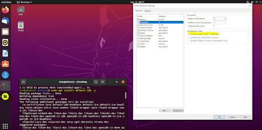
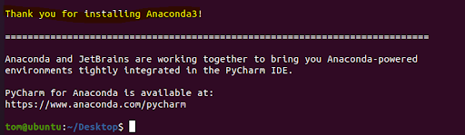
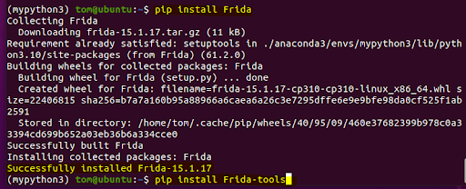
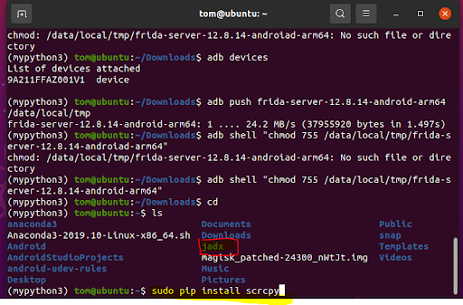
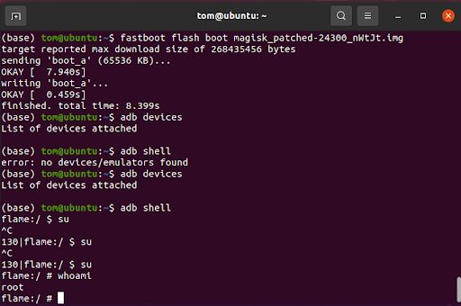
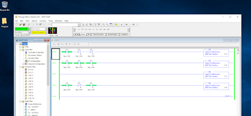

# Lab 2: Hardware Setup

## Write-up
### 1.	Demonstrate that you completed the tasks.
VMware Tasks Android Studio, open-jdk, and VM Settings:

  

Installed conda:

  

Python3 environment and Frida:

  

Jadx and scrcpy:

  

Rooting the phone:

  

### 2.	What are the security benefits and risks associated with rooting the device?
Rooting your phone is like having the keys to the castle. You have complete access to everything however if you lose them you are in big trouble. As the root user you have the ability to modify every file on the phone's file system as well as download anything you want. This means you can install fancy firewalls or accidently download the worst malware imaginable. Rooting your phone also risks bricking it and voids the warranty. The main benefits come with the implications that you know what you are doing.
### 3.	Do people still root their devices? If so, what are the reasons why they do this? What are other examples throughout digital history that show humans modifying their devices?
People still do root their devices. A common reason is many applications require root access in order to use all of their feaures. Additionally, some people enjoy the level of control they recieve from having a rooted device. One common historical example is jailbreaking Apple devices in order to bypass the several prohibitions that were in place stopping users from modifying the operating system and stoping them from installing non-officially approived applications. Another example is people rooting their phones to remove "bloatware" which is a term refering to software preinstalled that offers little to no use to the end user.
### 4.	What things can you do after rooting your phone that you could not otherwise do? Can you access any folders/files? Be specific. 
Rooting gives you complete control over your phone. A superuser has access to all of the devices system files, all aspects of the operating system, and is only really limited by their coding expertise. 
### 5.	Are there implications for Digital Rights Management? Any legal constraints with rooting an android phone?
There are implications for Digital Rights Management when rooting a phone. The general consensus is that it is illegal to circumvent digital rights managemnt schemes which is what rooting a phone is doing. That being said, there are some exemptions; for example, when it comes to the android phone we are using, the google pixel 4, it is not an issue as google has given permission for users to do so.  
### 6.	Did you break the law? Discuss.
I did not break the law as google has previously given users permission to root their phones. Legality concerns come into play when the manufacturers do not give permission to root the phone and people do it anyway. Additionally, it is generally accepted that phones can be rooted as long as they are being rooted only so legally obtained applications that require root level access can be used properly.  

## HILICS Write-up

### Provide a screenshot of RSLogix connected to your PLC in Online mode (REMOTE RUN or REMOTE PROGRAM).

  

